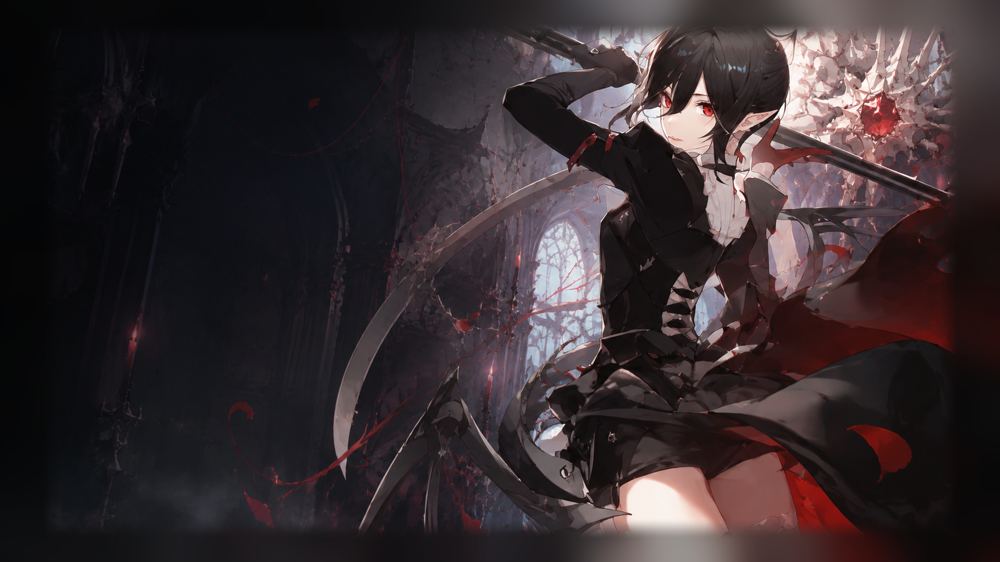

# [明日方舟/Arknights] 隐德来希｜Entelechia

《杀戮尖塔 2》自定义角色 Mod。隐德来希拥有较低的生命上限，通过主动失去生命、操纵敌人的血液状态并积蓄心烛，换取持续作战能力与高额爆发。



**快速入口：** [玩家指南](#player-guide) | [开发指南](#developer-guide) | [Steam 创意工坊](https://steamcommunity.com/sharedfiles/filedetails/?id=3763861013) | [问题反馈](#问题反馈)

## 主要内容

- 完整可玩的隐德来希角色
- 60 张角色卡牌，包含衍生牌
- 专属初始牌组与初始遗物
- 独立的角色选择、战斗、商店与火堆素材
- 简体中文为主要验收语言，英文提供基础支持

## 核心机制

- **萃血**：从敌人身上回收生命，并与部分格挡和续航效果联动。
- **失血**：持续削减敌人生命，并可进一步转化为萃血或其他收益。
- **心烛**：预先积蓄在敌人身上的伤害额度。攻击命中时触发无视格挡的生命流失，对普通敌人、精英和首领具有不同倍率。
- **血线**：部分卡牌会根据当前生命是否高于一半改变效果。高血侧重资源调度，低血侧重续航与反击。
- **生命支付**：部分高收益卡牌需要主动失去生命，以换取能量、抽牌、力量或更强的爆发。

---

<a id="player-guide"></a>

## 玩家指南

### Steam 创意工坊安装

1. 打开[隐德来希的 Steam 创意工坊页面](https://steamcommunity.com/sharedfiles/filedetails/?id=3763861013)。
2. 订阅页面列出的 `BaseLib` 前置 Mod。
3. 订阅隐德来希并启动游戏，在 Mod 管理界面确认 `BaseLib` 与 `Entelechia` 均已启用。

### 手动安装

1. 安装 `BaseLib 3.3.5` 或更高兼容版本。
2. 从本仓库的 [Releases](https://github.com/lemon970/Entelechia/releases) 下载发布包。
3. 将发布包中的 `Entelechia` 文件夹放入游戏目录的 `mods` 文件夹。

最终目录应为：

```text
Slay the Spire 2/
└─ mods/
   └─ Entelechia/
      ├─ Entelechia.dll
      ├─ Entelechia.json
      └─ Entelechia.pck
```

### 依赖与兼容性

| 项目 | 要求 |
| --- | --- |
| 游戏 | 《杀戮尖塔 2》0.107.0 或更高兼容版本 |
| 前置 Mod | BaseLib 3.3.5 或更高兼容版本 |
| 语言 | 简体中文完整支持，英文基础支持 |
| 游戏性 | 本 Mod 会添加角色并改变游戏玩法 |

### 常见问题

- **角色没有出现在选择界面**：确认 `BaseLib` 和 `Entelechia` 都已启用，并删除旧版本或重复安装的同名 Mod。
- **手动安装后无法加载**：检查目录层级，三个发布文件必须直接位于 `mods/Entelechia/` 下。
- **创意工坊更新未生效**：退出游戏后重新启动 Steam，等待工坊内容完成下载。
- **文本、卡牌结算或画面异常**：记录游戏版本、BaseLib 版本、复现步骤，并附上截图和日志反馈。

---

<a id="developer-guide"></a>

## 开发指南

### 技术栈

- .NET 9 / C#
- Godot .NET SDK 4.5.1
- BaseLib 3.3.5
- Harmony

Godot 版本应与游戏使用的版本一致。使用更高版本导出的 PCK 可能无法被游戏加载。

### 项目结构

```text
Entelechia/
├─ Entelechia/              # Godot 场景、图片和本地化资源
├─ EntelechiaCode/          # 角色、卡牌、能力、遗物与补丁代码
├─ tools/UpgradeProbe/      # 卡牌升级内部诊断工具
├─ Entelechia.csproj
├─ Entelechia.json
├─ project.godot
└─ Sts2PathDiscovery.props  # 自动发现本地游戏目录
```

### 环境要求

1. 安装 [.NET 9 SDK](https://dotnet.microsoft.com/download/dotnet/9.0)。
2. 安装带 .NET 支持的 Godot 4.5.1，并确保可以使用其命令行程序。
3. 通过 Steam 安装《杀戮尖塔 2》。
4. 克隆本仓库并还原 NuGet 依赖。

`Sts2PathDiscovery.props` 会尝试在 Windows、Linux 和 macOS 的常见 Steam 目录中查找游戏。自动发现失败时，可以通过 MSBuild 参数指定路径：

```powershell
dotnet build Entelechia.csproj -c Release /p:Sts2Path="<game-directory>"
```

### 构建 DLL

```powershell
dotnet build Entelechia.csproj -c Release
```

默认构建会将 DLL、PDB 和 Mod 清单复制到游戏的 `mods/Entelechia/`。只需要验证编译、不希望部署到游戏目录时：

```powershell
dotnet build Entelechia.csproj -c Release /p:SkipModDeployment=true
```

### 导出 PCK

发布完整 Mod 时，需要通过 Godot 导出资源包。可以设置 `GODOT_PATH` 环境变量：

```powershell
$env:GODOT_PATH = "<path-to-godot-console>"
dotnet publish Entelechia.csproj -c Release
```

也可以直接传入 Godot 路径：

```powershell
dotnet publish Entelechia.csproj -c Release /p:GodotPath="<path-to-godot-console>"
```

项目包含自定义 `.tscn` 场景，快速 PCK 打包器可能跳过这些资源。正式发布应使用上述 Godot 导出流程。

### 验证建议

提交代码前应先完成 Release 构建，并检查全部本地化 JSON 是否可以解析：

```powershell
Get-ChildItem Entelechia/localization -Recurse -Filter *.json |
    ForEach-Object {
        Get-Content -Raw -Encoding UTF8 -LiteralPath $_.FullName |
            ConvertFrom-Json | Out-Null
    }
```

`tools/UpgradeProbe` 保留用于升级数值与描述的内部诊断，但不能替代完整游戏环境。涉及卡牌结算、场景加载、动画或 UI 的修改仍需实机验收。

## 问题反馈

提交问题时请附上游戏版本、BaseLib 版本、复现步骤、截图与日志。涉及平衡性的反馈，请同时说明牌组、层数和具体战斗环境。

- Steam：[创意工坊讨论区](https://steamcommunity.com/sharedfiles/filedetails/?id=3763861013)
- 邮箱：[3406236139@qq.com](mailto:3406236139@qq.com)

## 版权与免责声明

本项目是玩家独立制作并免费发布的非商业同人 Mod，与上海鹰角网络科技有限公司、Mega Crit Games 及其关联方不存在隶属、合作、赞助或授权关系。

《明日方舟》、隐德来希及相关角色、世界观与原作素材的权利归上海鹰角网络科技有限公司及其他相关权利人所有；《杀戮尖塔 2》及相关内容的权利归 Mega Crit Games 所有。本项目不主张对上述原作内容的所有权。

若相关权利人认为本项目存在不当使用，请通过 Steam 或邮箱 `3406236139@qq.com` 联系作者；收到有效通知后，作者将及时处理相关内容。
